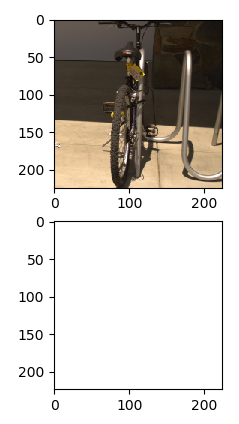
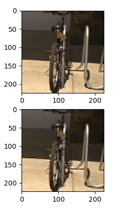

This document is to record things progress

### Jan 28th

- In Jpeg algorithm, not only 3) quantization loses precision, 1)RGB to YCbCr, 2) fourier transform also cause the same problem. In the document I read, 1) and 2) are supposed to be lossless however.

- Finish the naive version of model

### Feb 4

- Visualize the model
- Debug the model
- ToTensor scale the input by 1/255. I am concerned about the weight of quantization matrix
- Quantization matrix does not change much, it may has already stay in the local minimal, let's give it some random weights
- Another question is, how can I tell the tool "better" matrix (that minimize devision results in many sense)

### Feb 14

- Gradient was abnormal: it seems round() and clamp() are killing my gradient, so I rewrite them. Besides, I tried to scale all operations back to the range of 0 and 1. This is legal because rgb2ycbcr, dct are linear operations. Quantization, as long as I put the quantization matrix into the range of 0 and 1. It gives the same results.
- Backward propagation is working normally, the evidence is all quantize terms vanishes to 1, which elliminates all differences between graph after and before Jpeg compression. This arouses another problem of regularization.
- I try to regularize quantize terms. However, the quantization matrix goes to another extreme situation: either 1 for small row and col indexes, or 255 for large row and col indexes. 
- Another point confusing me is when the regulation term has huge difference in magnitude, e.g. 1000 vs. 1, to normal loss function. It seems that the loss function is still converging. One possible explanation is addition basically make the gradient calculation independent to each other. Then other weight still changes to the proper places as expected. Maybe I should stop training of all parameters except for the jpeg layer.

### Feb 20

- No obvious difference between jpeg version and non-compressed version (10 epochs, resnet, top1)

  | Compressed | Train Jpeg | Initialize with Jpeg Qtable | Regularization | Accuarcy |
  | ---------- | ---------- | --------------------------- | -------------- | -------- |
  | N          |            |                             |                | 91.6%    |
  | Y          | N          |                             |                | 91%      |
  | Y          | Y          | Y                           | N              | 92%      |
  | Y          | Y          | Y                           | Y              | 90%      |
  | Y          | Y          | N                           | N              | 86%      |
  | Y          | Y          | N                           | Y              | 86%      |

- Take a look at paper: https://arxiv.org/pdf/1803.05788.pdf

  - Test and train with different compression rate.

  - Confusion at the final results, case 1 or case 2? Testing?

  - How do they calculate compression rate? It seems to vary a lot.

  - Below is the compression testing for a pretrained resnet.

    | Quality Factor | Scaling to qtable | Accuracy |
    | -------------- | ----------------- | -------- |
    | 50             | 1                 | 90%      |
    | 20             | 2.5               | 87%      |

- The more parameter I train, less likely it converges, especially for some pixel with high frequency

  - It turns out to be the result of vanishing high frequency component.

- Design choice

  - round(input/quantize)*quantize, does the second quantize require gradient?
    - `-input/q+round(input/q)`
    - `-input/q`
  - quantize matrix, stochastic value of 1 to 255? 
    - -255 to 255, withtout rounding
  - Make quantize matrix and input in the range of 0 and 1, for training
    - By default, input is in the range of 0 and 1


### March 6

- Experiments on compression ratio versus certain quality (quantization table), original file size is (150582 bytes)

  - Code can be check here: https://github.com/cucapra/JpegNN/tree/master/src/compressRatio (zigzag, dc ac component, huffman)

  - The compression rate is stable for certian qtable. We can therefore train our own qtables (which should also gives similar plot).

  | quality = 20, mean = 21000 bytes, 7.5x comp | quality = 50, mean = 40000 bytes, 3.7x comp |
  | ------------------------------------------- | ------------------------------------------- |
  |      |      |

- Experiments are conducted to see: (a) If the *Compression Leading to Acc Loss* problem exists? (b) If the problem exists, can we design better qtable with same compression rate but higher/same accuracy?

  - Setup:
    - __Dataset of 3 classes, 1384 for training and 142 for validating__. *Is the validation data too small?*
    - __25 epochs__
    - __Resnet__
    - __1/ L1 Regularization, 0.5 factor__

  - 4 experiments (Check https://github.com/cucapra/JpegNN/tree/master/result for detail):

    - quality_noft* = Train and val cnn with different quality (10:10:100).
    - *test_quality* = Train cnn only with uncompressed image and val cnn with different quality(10:10:100). Trained cnn has an accuracy of 96.4%
    - *train_quality* = Train cnn only with different quality (10:10:100) and val with uncompress image.
    - *jpeg_noft* = Train qtable and cnn together with regularization (10 times to ensure reproducable results).

     

  - I pick the qtable of first trail and plot the histogram. It seems possible to get a 96% accuracy with 5x compression. (This one! https://github.com/cucapra/JpegNN/blob/master/result/qtables/qtable_my1.txt)

  <span style="color:red">wrong</span>.

- Issues:

  - Not large accuracy differences between low quality and high quality(variation of 94 to 96). Taining with low quality data can fix everything.

    - Perhaps we can use larger validation set.
    - Or solve the test-quality issue: train a network with high quality images, but testing get affected. (But why not just train with low quality images? How about fine tunning?) 
    - Change to other topics, not image classification

  - Validation uses qtable as integer, which opens a gap between training and validation accuracy. Sometimes we have 0.33 accuarcy for validation. Do we truly need integer qtable?

    - Typical print: https://github.com/cucapra/JpegNN/blob/master/result/jpeg_noft/jpeg_noft3

    - A typical qtable that fails is shown in https://github.com/cucapra/JpegNN/blob/master/result/qtables/qtable_fail.txt

      | Failed when we quantize qtable | Meaningful results              |
      | ------------------------------ | ------------------------------- |
      |       |  |

### March 27

- Semantic segmentation for MIT ADE20K dataset, encoder resnet50dilated, decoder ppm_deepsup, epoch 20.

  -  No fake uncompression: a) downsampling cannot simulate uncomp; b) annotation becomes tricky; c) by default, the input get [random scaled](https://github.com/CSAILVision/semantic-segmentation-pytorch/blob/master/train.py#L265), why.

   !

  | jpeg, quality 20                       | Jpeg, quality = 20                     |
  | -------------------------------------- | -------------------------------------- |
  | 62.5%                                  | 53.6%                                  |
  |  |  |

- Classification

  - Compression rate difference between uncompressed image and fake uncompressed images (resnet, epoche = 25, 1/L1 regularization, factor = 0.1, different dataset <font size="2">**tricky**</font>).

    |            | uncomp (jenna)               | fake uncomp (comp jenna, down sample) |
    | ---------- | ---------------------------- | ------------------------------------- |
    | jpeg 20    |                              |                                       |
    | my jpeg 20 | 21000 bits, 7.5x compression | 7300 bits, 5x compression             |

  - Observations 

    - The gap of 2 times compression rate difference is too large. Fake uncompression make not be a good approximate for uncompressed image, especially when our focus is compression rate. 
    - Quantization table may differ from application to application (my jpeg on different classification tasks). 

- Design questions
  - How to initialize?
    - Initialize with standard qtable and random value. The performance of the latter is really bad. [Here](https://github.com/cucapra/JpegNN/blob/master/result/qtable_rq10) is the training result of 3 classes classification task. 
  - How to design regularization term? 
    - Observe the change of qtable of same initialization: a) All terms increases and then the first frequency component increase slower and then decreases. In zig-zag manner, 2-3 then get affectedm, and then 4-6. b) Chrominance and illuminance differences.
    - 1/L1 regularization may not simulate compression rate well. Integrate compression? Will batch size change the behavior of training?
  - What if the high frequency component hypothesis is wrong?
    - Train with fixed cnn and observe the behavior of qtable. It always decreases from high frequency components!

###April 12

- Compressed file size vs. $\sum_{i=0}^{63} F_{i} / Q_{i}$

  

- Fixing some error or system problem: 

  - remove abs in normalization

  - Strip unit test shows that python is bad when precision is too high. The solution I give is to mask $std <10^{-5}$ components to zero. (change to mean of absolute value)

  - Setting training rate to 0.001 fix 96% accuracy problem. Setting regularization factor to 0.05 gives 96.0% accuracy (as good as without jpeg). Mask lower half of the qtable gives 95.5% accuarcy. Setting regularizaiton factor to 0.3 gives 95.3% accuracy, and the compressed figure looks quite different.

    

- Problems:
  - Cannot reproduce > 90% accuracy result without pretrained model. I hope it is initialized without pretrained parameter since the starting point may affect where qtable converges to. (train with simple model)
  - Checkerboard exam shows it's hard to distinguish "importance" of qtable non-zero terms, no magnitude difference. (explain checkerboard; )


###April 24

- To know if current network is able to learn the importance of qtable, we need to test with specific dataset.
  - One way to do this is to create a 8x8 frequency table as DCT of some input 8x8 pixels, where only the center 4x4 pixels are a) vertically b) horizontally increasing. Other pixels are uniformly random.
  - However, it turns out applying inverse dct to randomly generated frequency cannot produce pixels in the range of 0 to 255. Shifting and scaling the pixels doesn't work. It will change the frequency distribution.
  - The other approach I tried was to randomly generate 8x8 pixels, transform them to 8x8 frequency table. Then sorting the center 4x4 frequencies and use inverse dctII to transform them back and round to integers. I also do the dctII transformation to verify if see if integers round keeps sorting, and they are just normal.

- | Setup (10 epoches)                                           | Accuracy |
  | ------------------------------------------------------------ | -------- |
  | mask frequency except 4x4 center frequencies, no normalization | 100%     |
  | mask frequency except 4x4 center frequencies, with normalization | 99.5%    |
  | no masking, no normalization (qtable seems random)           | 97.5%    |
  | no masking, with normalization (qtable seems random)         | 96.5%    |
  | quatization table fxied, no masking                          | 99.5%    |
  | without regularization, start with medium level qtable, learn center convergence rate |          |

- look at math work! with simple network (jpeg layer + linear layer)

### June 10th

- Fixed point

  - word length :word length of each fixed point number
  - floating length:  fractional length of each fixed point number

- Floating point

  - mantissa: a signed (meaning positive or negative) digit string of a given length in a given base.

  - exponent: the magnitude of the number.

|            | exp = 5, man = 2 | exp = 2, man = 1 |
| ---------- | ---------------- | ---------------- |
| nearest    | 94.6%            | 91.0%            |
| stochastic | 94.7%            | 92.5%            |

- Limited knowledge we can borrow from qpytorch:

  - double *ldexp*(double value, int exp); //return $value*2^{exp}$

  - [nearest_round(a[index], sigma);](<https://github.com/Tiiiger/QPyTorch/blob/ca227d9e8827dd77d4eb59f21c70d422f8ac6e51/qtorch/quant/quant_cuda/fixed_point_kernel.cu#L41-L54>)

    ```c++
    __device__ __forceinline__ float nearest_round(float a, int sigma) {
      a = ldexp(a, -sigma); 
      a = round(a);
      a = ldexp(a, sigma);
      return a;
    }
    ```

- Adaptive quantization of neural networks (no source code, sad)

  - It generalizes quantization problem: 

    ​	$$\min \limits_{W} N_Q(W) = 􏰆\sum N_q(ω_i)$$

    ​	$$L(W ) ≤ \overline{l} $$

    where $N_q(ω_i)$ is the minimum number of bits required to represent $ω_i$ in its fixed-point format.

  - Given $ω_i q ← round(2^{N_q^i} ω_i)/2^{N_q^i}$ (assuming $w_i \in (0,1)$), it can be deduced that $N_Q(W) \leq -\sum^n_{i=1} log_2 \tau_i $

  - Under specific loss function, we can solve $\tau$ with KTT conditions and the learn $N_Q(W)$. (The only problem is I don't fully understand the proof start from KTT condition...)


